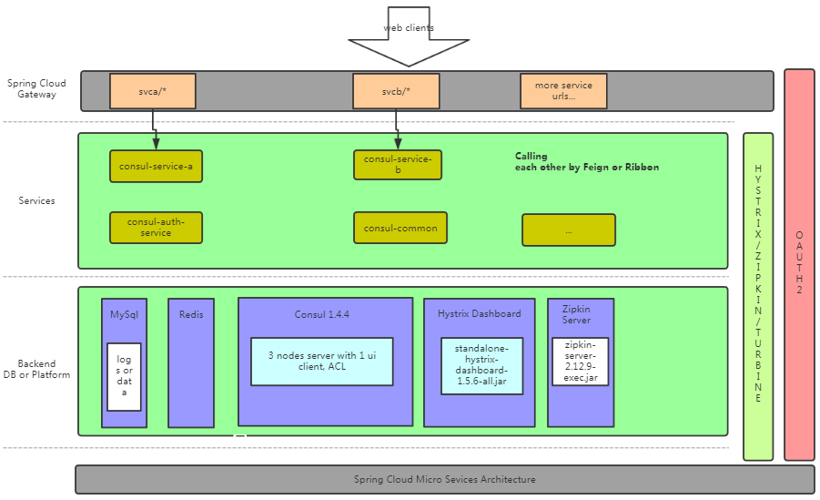
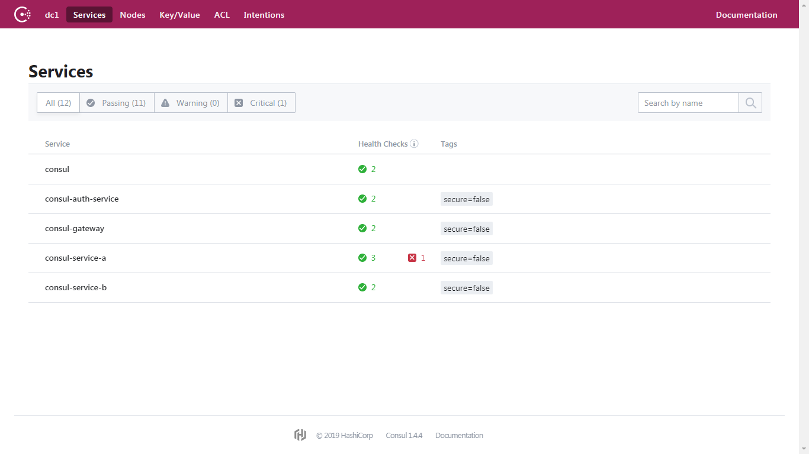
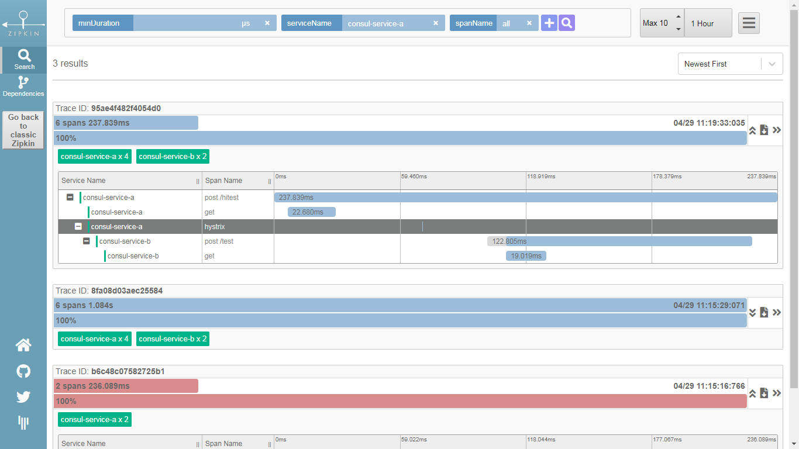
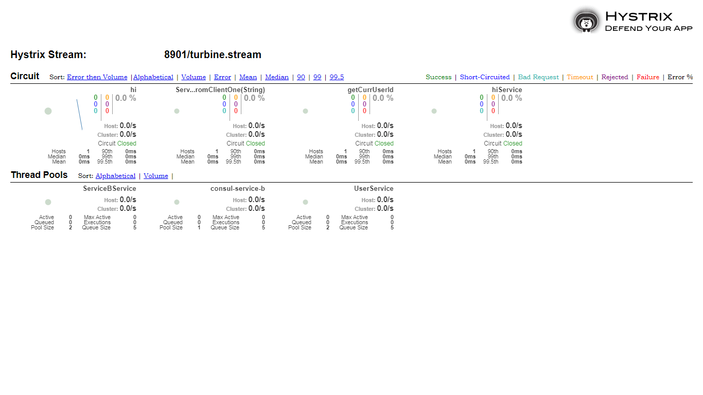
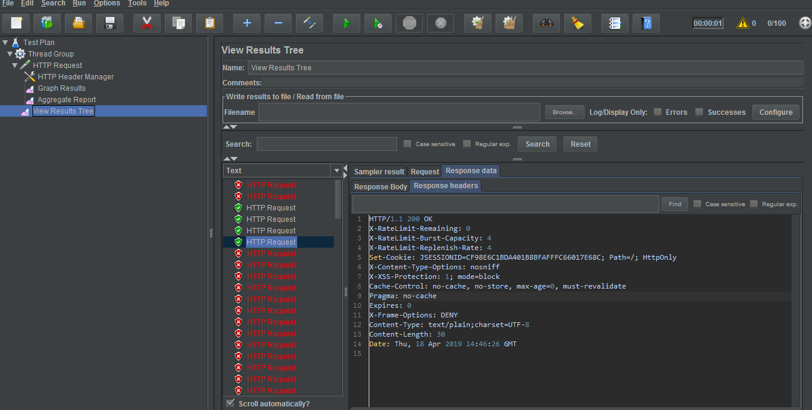

# Based on Spring Cloud Consul - micro services architecture  

# Maven Projects
1. consul-auth-service: OAuth2 Authentification, registered to Consul
2. consul-common: commonly used components by all other projects.
3. consul-gateway:  load-balanced configurations for svca and svcb, rate-limiter and etc.
4. consul-service-a: demonstrated how to use feign client and ribbon client with Oauth2 supported to call B project.
5. consul-service-b: 


# stacks points
* Spring boot 2.0.4
* Consul Server 1.4.4
* Hystrix & Dashboard
* Spring Cloud Sleuth/zipkin  
* Ribbon 
* Turbine 
* Feign
* Spring Cloud OAuth2 

#screenshots
 
 
 
 
 


# consul list
```
[root@hadoopnode3 ~]# consul members -http-addr=10.0.0.8:8500
Node     Address            Status  Type    Build  Protocol  DC   Segment
node104  10.0.0.104:8301  alive   server  1.4.4  2         dc1  <all>
node19   10.0.0.19:8301     alive   server  1.4.4  2         dc1  <all>
node9    10.0.0.9:8301     alive   server  1.4.4  2         dc1  <all>
node8   10.0.0.8:8301     alive   client  1.4.4  2         dc1  <default>
```